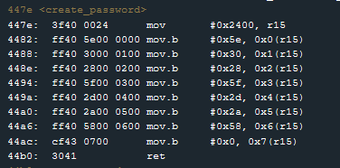

# Microcorruption New Orleans walkthrough

Welcome, to Microcorruption. If you're reading this, you're either very, very lost, or have an interest in reverse-engineering and hacking. Microcorruption is a series of challenges that task you with opening a virtual door, by exploiting vulnerabilities in the code of a smart lock. If you can get through all of the challenges, you'll have a good understanding of how programs are executed at their lowest level, how bad programming practices can be exploited, and how buffer-overflows (and other exploitation techniques) work. 

The smart lock is based around the TI MSP430 CPU. The instruction set of the MSP430 is very beginner friendly and you should be able to pick it up easily. You should read the lock manual before starting. You can get in-depth information about instructions by looking up the MSP430 User's Guide. 

After you complete the tutorial, you should have a basic knowledge of what's going on on-screen. It looks overwhelming to start, but once you get the hang of things everything will click together. Right now, we don't have a very clear understanding of what the program is doing, so first let's check out the program disassembly. 

The program starts at `0x4400` and executes an initialization routine. You can safely ignore these, as all they do is set the program up to run properly. Let's start by taking a look at the main function. 


It's pretty simple, and by ignoring assembly specifics it can be broken down to the following:

1) Call the create_password() function
2) Print the string "Enter the password to continue" to output
3) Call the get_password() function
4) Call the check_password() function
5) Test if the value stored in register 15 is equal to zero and set the status register accordingly
6) Make a jump to `0x4462` if the status register indicates r15 is non-zero. If not do nothing
7) If a jump is not made, print the string "Invalid password; try again." to output and end execution.
8) If a jump is made, print "Access Granted!" to output and call unlock_door()

When trying to get a picture of how a program executes, start at the main() function, and look at what functions main() calls. Once you know what can happen, you can start to piece together how. Look for jmp instructions (jnz, jz) and where they point to in the program. You'll see what "paths" a program can take during it's execution. 

This is only the beginning, but you should have a vague idea of what an disassembled program looks like by now. We'll go through each relavant function and break down what each one does.

## create_password()



The function moves different values into memory byte by byte. I'll break down exactly what happens here.

```
mov     #0x2400, r15    ; move the value 0x2400 into register r15.
mov.b	#0x5e, 0x0(r15) ; copy the byte 0x5e, into the address stored in r15, plus an offset of zero.
mov.b	#0x30, 0x1(r15) ; copy the byte 0x30, into the address stored in r15, plus an offset of one.
mov.b	#0x28, 0x2(r15) ; copy the byte 0x28, into the address stored in r15, plus an offset of two.
mov.b	#0x5f, 0x3(r15) ; copy the byte 0x5f, into the address stored in r15, plus an offset of three.
mov.b	#0x2d, 0x4(r15) ; copy the byte 0x2d, into the address stored in r15, plus an offset of four.
mov.b	#0x2a, 0x5(r15) ; copy the byte 0x2a, into the address stored in r15, plus an offset of five.
mov.b	#0x58, 0x6(r15) ; copy the byte 0x58, into the address stored in r15, plus an offset of six.
mov.b	#0x0, 0x7(r15)  ; copy the byte 0x7, into the address stored in r15, plus an offset of seven.
ret                     ; return
```

On the very left of each line of assembly, is the address of the code in memory. To the right of that, the machine code of the instruction and arguments. To the right of that, are human readable mnemonics that represent the machine code. 

Values are being copied byte by byte to memory. The base address is held in register 15, 0x2400. This function is suspicious, it's involved with the password and is writing to memory. Let's step through the function and see what happens at memory address 0x2400. 

Go ahead and set a breakpoint at the start of the create_password function. Type `c` into the debugger console. At this point the program will be halted right before the function begins. Before stepping through the function, use the live memory dump to look at memory address `0x2400`. Step forward one instruction. You'll notice that r15 gets set to 2400. Step forward once more, and you'll see the memory contents change based on the executed instructions. To the right, you'll see an ASCII representation of values in memory. This will be usefull shortly. 

## get_password()

The next function called from main is the get_password() function. It's not very exciting, but it's a good introduction to the world of software interrupts. 


All this function does is move the value 0x64 into register 14 and call getsn().


getsn() pushes data on the stack and calls INT(). Don't worry if this seems confusing, there's a lot here.


INT() is a function that executes an [Interrupt](https://en.wikipedia.org/wiki/Interrupt). It's a bit complex. I'll be breaking it down in a later post, but for now understand that: The inturrupt type is passed through register 2 (which is the status register) and that other arguments are passed on the stack (more on this in a coming post). The interrupt called is interrupt 0x02, which reads a number of bytes to memory. 

As soon as the interrupt is called, you'll see the familiar "enter password" screen. Interrupts are what make I/O happen.

## check_password()


This function is interesting, it's a good example of a conditional loop. To best understand this function, you should step through it. Go ahead and set a breakpoint at the top of this function. Stepping through the function, you can get an idea what this function does. After clearing register 14, you'll see register 15 copied into register 13. 


This looks like a memory address. No harm in checking what's at address 0x493c. Type `r 439c` into the debug console to view the memory at that address. You'll see your password stored at address 0x439c. The rest of the function can be broken down as follows:

```
add 	r14, r13            ;

cmp.b	@r13, 0x2400(r14)   ; compare the byte at the memory address held in r13 
                            ; to memory address 0x2400
                            ; note that the result of a comparison instruction 
                            ; affects the status register (sr)
                            
jne     #0x44d2             ; jump to address 0x44d2 if the zero bit in the 
                            ; status register is not set.
                            ; if the zero bit was set, the operands of 
                            ; the cmp instruction were equal to each other.
                                                        
inc     r14                 ; increment register 14 by one. 

cmp     #0x8, r14           ; compare register 14 with 0x8

jne     #0x44be             ; if register 14 is not equal to 0x8, jump to 
                            ; address 0x044be which is 2 instructions 
                            ; after the start of this function.
                            
mov     #0x1, r15           ; move the value 0x1 into register 15. 

ret                         ; exit out of the function, returning 
                            ; to the previous function.

clr     r15                 ; set r15 to zero. This is where the 
                            ; first jump points to

ret                         ; exit out of the function, returning to 
                            ; the previous function.
```

This is a perfect example of a for loop. It would translate roughly to the following pseudo-code:

```
while i < 8 {
    if user_password[i] != string_in_memory[i] {
        r15 = 0;
        return()
    }
    else {
        r15 = 1;
        return()
    }
}
```
The function iterates over both the string supplied by the user, and the string stored in memory. It sets r15 to 0x01 if the strings match, and r15 to 0x00 if they do not. The function then returns to main().

## Tying it all together

Back at the main function, we only have the following left. 


You'll see that the value we just stored in r15, (based on if the strings match or not) is tested. After that, we have a conditional jump if the status register doesn't have the zero bit set. So, if the value of r15 is one, jump to the code that prints "Access Granted!" and unlocks the door. 

By investigating the string that the user supplied string is compared against (`r 439c`), you'll see what string must be supplied in order to set r15 to 1... That can't be good for lockIT.
